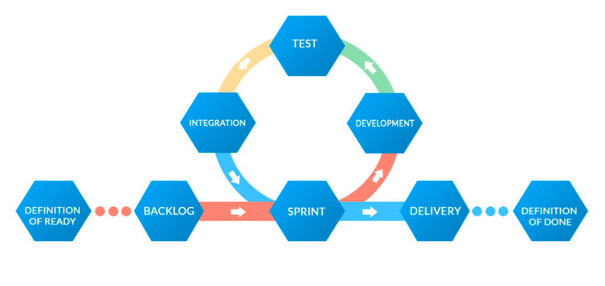

# Agile model

[Zpět na uvodní stránku](README.md)

Agilní model vývoje softwaru je flexibilní a iterativní přístup k vývoji, který umožňuje rychlé reakce na změny požadavků a zahrnuje aktivní spolupráci mezi týmy. Zde jsou základní principy agilního přístupu:

1. **Zakázka (User Stories/Backlog):**

   - Požadavky na systém jsou zachyceny v podobě "uživatelských příběhů" nebo záznamů v backlogu.
   - Backlog obsahuje seznam všech funkcí a úprav, které mají být provedeny, a tým si vybírá úkoly, kterými se bude zabývat v daném iterativním cyklu (sprintu).

2. **Sprintové plánování (Sprint Planning):**

   - Tým vybírá úkoly z backlogu, který se chce věnovat během následujícího iterativního cyklu (sprintu).
   - Definují se cíle sprintu a přidělují se úkoly jednotlivým členům týmu.

3. **Implementace (Implementation):**

   - Tým pracuje na implementaci vybraných úkolů.
   - Každý sprint by měl produkovat funkční a potenciálně otestovatelný inkrement produktu.

4. **Testování a Opravy (Testing and Review):**

   - Během a po každém sprintu jsou prováděny testy k ověření funkčnosti implementovaných částí.
   - Zákazník nebo produktový vlastník hodnotí výsledky a poskytuje zpětnou vazbu.

5. **Retrospektiva (Sprint Retrospective):**

   - Na konci každého sprintu tým hodnotí proces, identifikuje, co bylo dobré a co lze zlepšit, a plánuje úpravy pro další sprint.

6. **Opakování (Iteration):**
   - Cyklus (sprint) se opakuje, přičemž každý nový sprint přináší nové funkční vylepšení nebo změny.
   - Tým pružně reaguje na zpětnou vazbu od zákazníka nebo na nové požadavky, které mohou vzniknout během vývoje.

Agilní model vývoje je známý svou schopností rychle reagovat na změny a zapojením zákazníka do procesu vývoje. Týmy pracují v krátkých iterativních cyklech, což umožňuje rychlou dodávku funkčního produktu. Agilní přístup je vhodný pro projekty, kde jsou požadavky nejisté nebo se mohou měnit během vývoje.
