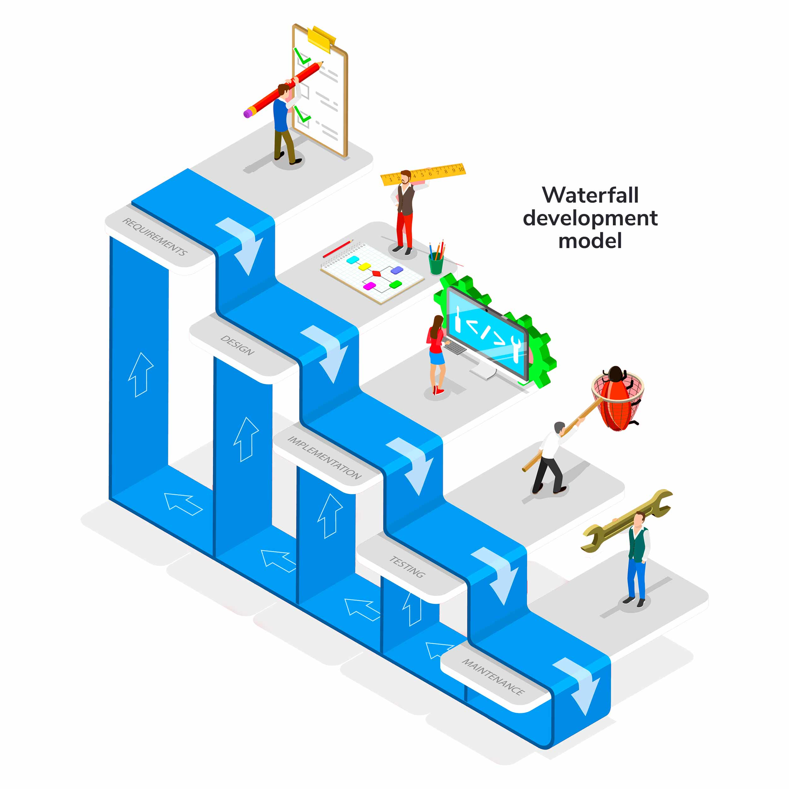

# Waterfall model

[Zpět na uvodní stránku](README.md)

Vodopádový model (Waterfall model) je klasickým lineárním modelovým přístupem k softwarovému vývoji. Je rozdělen do několika fází, které jsou prováděny postupně a každá fáze má svůj vlastní cíl. Jedná se o sekvenční a neustále se pohybující model, kde každá fáze následuje předchozí fázi a žádná z nich není zahájena, dokud není předchozí dokončena. Následující jsou základní fáze Waterfall modelu:

1. **Definice požadavků (Requirements):**

   - V této fázi jsou shromažďovány a analyzovány veškeré požadavky od zákazníka nebo klienta.
   - Cílem je vytvořit podrobnou specifikaci, která bude obsahovat veškeré požadované funkce a vlastnosti systému.

2. **Návrh (Design):**

   - Na základě specifikace požadavků je vytvořen návrh systému.
   - Tato fáze zahrnuje tvorbu architektury, datových struktur, hardwarových nebo softwarových specifikací a dalších aspektů systému.

3. **Realizace (Implementation):**

   - V této fázi jsou implementovány navržené systémové komponenty na základě návrhu.
   - Programátoři pracují na vytváření kódu a integrují jednotlivé části systému.

4. **Testování (Testing):**

   - Kompletní systém je podroben testování, aby bylo zajištěno, že splňuje specifikace a funguje správně.
   - Testování může zahrnovat různé typy, jako jsou testy jednotlivých komponent, integrační testy a akceptační testy.

5. **Údržba (Maintenance):**
   - Po úspěšném testování je systém uveden do provozu.
   - V této fázi může být provedena údržba, aktualizace nebo opravy chyb v systému.

Jednou z hlavních výhod Waterfall modelu je jeho jednoduchost a snadná správa. Nicméně může být nepružný v případě, že požadavky klienta se mění během procesu vývoje. V takovém případě může být obtížné provádět změny, protože každá fáze musí být dokončena před postupem na další. Moderní přístupy k vývoji, jako je Agile, se snaží překonat některé nedostatky Waterfall modelu tím, že umožňují pružnější reakci na změny požadavků.
